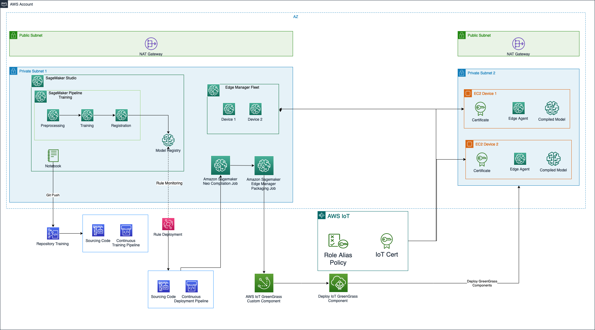

# SageMaker End to End lab for IoT devices using Edge Manager 

In this repository, we are stepping through an end to end implementation of Machine Learning (ML) models using Amazon SageMaker,
by targeting as deployment environment simulated remote edge devices using [Amazon SageMaker Edge Manager](https://docs.aws.amazon.com/sagemaker/latest/dg/edge.html) 
and [AWS IoT GreenGrass](https://docs.aws.amazon.com/greengrass/v1/developerguide/what-is-gg.html).

This is a sample code repository for demonstrating how to organize your code for build and train your model, by starting from 
an implementation through notebooks for arriving to a code structure architecture for implementing ML pipeline using Amazon 
SageMaker Pipeline, and how to setup a repository for deploying ML models using CI/CD.

This repository is enriched by CloudFormation templates for setting up the ML environment, by creating the SageMaker Studio 
environment, Networking, and CI/CD for deploying ML models

Everything can be tested by using the example notebooks for running training on SageMaker using the following frameworks:
* [PyTorch](https://pytorch.org/)

## Environment Setup

Setup the ML environment by deploying the [CloudFormation](./infrastructure_templates) templates described as below:

1. [00-networking](./infrastructure_templates/00-networking/template.yml): This template is creating a networking resources,  
such as VPC, Private Subnets, Security Groups, for a secure environment for Amazon SageMaker Studio. The necessary variables 
used by SageMaker Studio are stored using [AWS Systems Manager](https://docs.aws.amazon.com/systems-manager/latest/userguide/what-is-systems-manager.html)
2. [01-sagemaker-studio](./infrastructure_templates/01-sagemaker-studio-environment/template.yml): This template is creating 
the SageMaker Studio environment, with the necessary execution role used during the experimentation and the execution of the 
SageMaker Jobs. *Parameters*:
   1. *SageMakerDomainName*: Name to assign to the Amazon SageMaker Studio Domain. *Mandatory* 
   2. *SecurityGroupId*: Provide a Security Group for studio if you want to use your own networking setup, otherwise the parameter
   is read by using AWS SSM after the deployment of the template [00-networking](./infrastructure_templates/00-networking/template.yml). *Optional*
   3. *SubnetId*: Provide a Subnet (Public or Private) for studio if you want to use your own networking setup, otherwise the parameter
   is read by using AWS SSM after the deployment of the template [00-networking](./infrastructure_templates/00-networking/template). *Optional*
   4. *VpcId*: Provide a Vpc ID for studio if you want to use your own networking setup, otherwise the parameter is read by 
   using AWS SSM after the deployment of the template [00-networking](./infrastructure_templates/00-networking/template). *Optional*
3. [02-ci-cd](./infrastructure_templates/02-ci-cd/template.yml): This template is creating the CI/CD pipelines using 
[AWS CodeBuild](https://docs.aws.amazon.com/codebuild/latest/userguide/welcome.html) and [AWS CodePipeline](https://docs.aws.amazon.com/codepipeline/latest/userguide/welcome.html).
It creates two CI/CD pipelines, linked to two AWS CodeCommit repositories, one for training and one for deployment, that can 
be triggered through pushes on the main branch or with the automation part deployed in the next stack. *Parameters*:
   1. *AccountIdDev*: AWS Account ID where Data Scientists will develop ML code artifacts. If not specified, the AWS current account 
   will be used. *Optional*
   2. *PipelineSuffix*: Suffix to use for creating the CI/CD pipelines. *Mandatory*
   3. *RepositoryTrainingName*: Name for the repository where the build and train code will be stored. *Mandatory*
   4. *RepositoryDeploymentName*:  Name for the repository where the deployment code will be stored. *Mandatory*
   5. *S3BucketArtifacts*: Name of the Amazon S3 Bucket that will be created in the next stack used for storing code and model artifacts. *Mandatory*
4. [03-ml-environment](./infrastructure_templates/03-ml-environment/template.yml): This template is creating the necessary resources for the 
ML workflow, such as Amazon S3 bucket for storing code and model artifacts, [Amazon SageMaker Model Registry](https://docs.aws.amazon.com/sagemaker/latest/dg/model-registry.html) 
for versioning trained ML models, and [Amazon EventBridge Rule](https://docs.aws.amazon.com/eventbridge/latest/userguide/eb-rules.html) 
for monitoring updates in the SageMaker Model Registry and start the CI/CD pipeline for deploying ML models in the production environments.
*Parameters*:
   1. AccountIdTooling: AWS Account ID where CI/CD is deployed. Can be empty if you have deployed the complete stack. In this 
   case, the parameter is read through SSM. *Optional*
   2. CodePipelineDeploymentArn: ARN of the CodePipeline used for deploying ML models. Can be empty if you have deployed the complete stack. In this 
   case, the parameter is read through SSM. *Optional*
   3. ModelPackageGroupDescription: Description of the Amazon SageMaker Model Package Group. This value can be empty. *Optional*
   4. ModelPackageGroupName: Name of the Amazon SageMaker Model Package Group where ML models will be stored. *Mandatory*
   5. S3BucketName: Name for the S3 bucket where ML model artifacts, code artifacts, and data will be stored. *Mandatory*
5. [04-ec2-device-fleet](./infrastructure_templates/04-ec2-device-fleet/template.yml): This template is creating the necessary resources for 
a cloud digital twin, such as EC2 instances, SageMaker Edge Manager Device Fleet, IoT Policies and Roles. *Optional parameters*:
   1. SageMakerStudioRoleName: IAM Role used by SageMaker. If you deployed the entire stack, this value is taken through SSM
   2. S3BucketML: S3 Bucket used for ML purposes. If you deployed the entire stack, this value is taken through SSM

## Labs

### Build and Train ML models

The code structure defined for the [Build and Train ML models](seed_code/00-model-build-train) is the following:

* [algorithms](seed_code/00-model-build-train/algorithms): The code used by the ML pipelines for processing and training ML models is stored in this folder
  * [algorithms/preprocessing](seed_code/00-model-build-train/algorithms/preprocessing): This folder contains the python code for performing processing of data
  using Amazon SageMaker Processing Jobs
  * [algorithms/training](seed_code/00-model-build-train/algorithms/training): This folder contains the python code for training a custom ML model 
  using Amazon SageMaker Training Jobs
* [mlpipelines](seed_code/00-model-build-train/mlpipelines): This folder contains some utilities scripts created in the official AWS example 
[Amazon SageMaker secure MLOps](https://github.com/aws-samples/amazon-sagemaker-secure-mlops) and it contains the definition for the 
Amazon SageMaker Pipeline used for training
  * [mlpipelines/training](seed_code/00-model-build-train/mlpipelines/training): This folder contains the python code for the ML pipelines used for training
* [notebooks](seed_code/00-model-build-train/notebooks): This folder contains the lab notebooks to use for this workshop:
  * [notebooks/00-Data-Visualization](seed_code/00-model-build-train/notebooks/00-Data-Visualization.ipynb): Explore the input data and test the processing scripts 
  in the notebook
  * [notebooks/01-Training-with-Pytorch](seed_code/00-model-build-train/notebooks/01-Training-with-Pytorch.ipynb): SageMaker 
  End to End approach for processing data using SageMaker Processing, Training the ML model using SageMaker Training, Register 
  the trained model version by using Amazon SageMaker Model Registry, evaulate your model by creating inference data using 
  Amazon SageMaker Batch Transform
  * [notebooks/02-SageMaker-Pipeline-Training](seed_code/00-model-build-train/notebooks/02-SageMaker-Pipeline-Training.ipynb): Define 
  the workflow steps and test the entire end to end using Amazon SageMaker Pipeline

### Deploy ML models to simulated edge devices

The code structure defined for the [Deploy ML models to simulated edge devices](seed_code/01-model-deploy) is the following:

* [algorithms](seed_code/01-model-deploy/algorithms): The code used for creating the AWS GreenGrass inference component is stored in this folder
  * [algorithms/inference](seed_code/01-model-deploy/algorithms/inference): This folder contains the scripts used for performing 
  inference on the edge devices. It contains also the recipe definition for the AWS GreenGrass component for inference
* [mlpipelines](seed_code/01-model-deploy/mlpipelines): This folder contains some utilities scripts created in the official AWS example 
[Amazon SageMaker secure MLOps](https://github.com/aws-samples/amazon-sagemaker-secure-mlops) and it contains the definition of 
the script for performing Compilation, Packaging and GreenGrass Deployment
  * [mlpipelines/deployment](seed_code/01-model-deploy/mlpipelines/deployment): This folder contains the python code for 
  running SageMaker Neo compilation Job, SageMaker Edge Manager Packaging Job and GreenGrass deployment of the model and inference components
* [notebooks](seed_code/01-model-deploy/notebooks): This folder contains the lab notebooks to use for this workshop:
  * [notebooks/00-Package-using-ggv2](seed_code/01-model-deploy/notebooks/00-Package-using-ggv2.ipynb): Explore the usage of 
  Amazon SageMaker Neo, Amazon SageMaker Edge Manager for creating IoT GreenGrass components for the ML model read from the 
  Amazon SageMaker Model Registry. It also create the IoT GreenGrass Component for inference, and creates the deployment component 
  for the Edge devices.
  * [notebooks/01-Run-simulated-fleet-ggv2](seed_code/01-model-deploy/notebooks/01-Run-simulated-fleet-ggv2.ipynb): Run a simulation of 
  wind turbine and test the behaviour of the ML model deployed
  * [notebooks/02-Pipeline-Deployment](seed_code/01-model-deploy/notebooks/02-Pipeline-Deployment.ipynb): Test the execution of the Pipeline 
  script before pushing in the repository for CI/CD automation